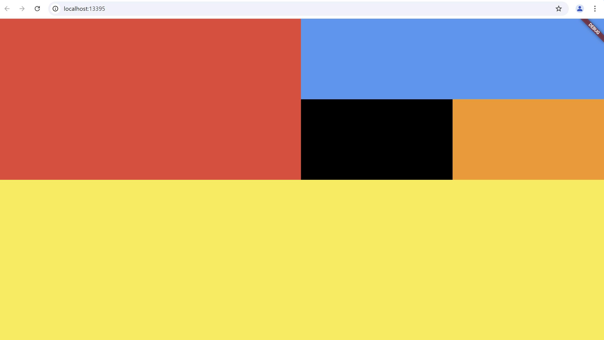
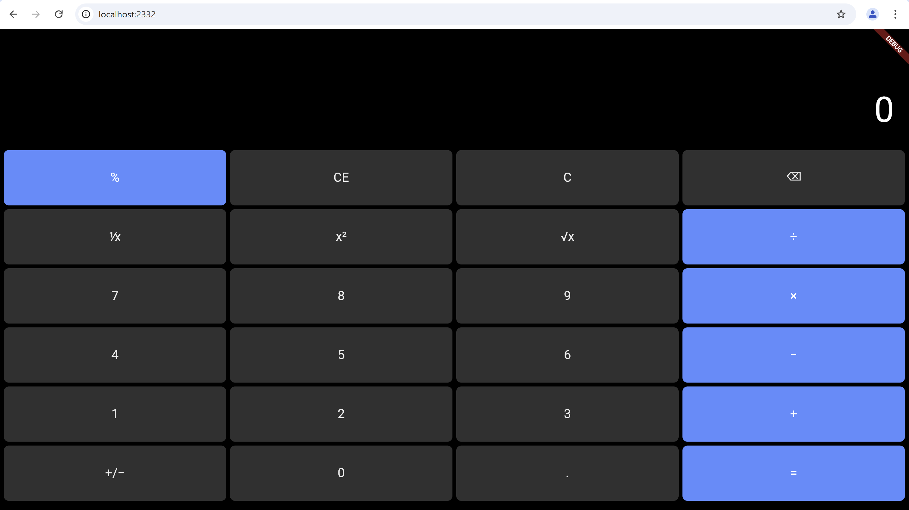

# 250401

## 기본위젯

### 위젯이란?
- 위젯은 UI를 구성하는 기본 단위
- 위젯은 화면에 표시되는 모든 것을 정의
- 버튼, 텍스트, 이미지, 레이아웃 등 모든 구성 요소가 위젯으로 표현됨

#### 연습 방법
- 최초 템플릿 프로젝트에서 body 내용을 수정하는 것을 기본으로 한다 
  
  ※ body가 AppBar 아래의 영역

- DartPad를 활용

    ※ 간단한 플러터 코드를 바로 실행 가능

- 플러터 스튜디오
  
  드래그&드롭으로 위젯을 간단히 시험, 코드 수정X 

#### 과제1 Color
```dart
import 'package:flutter/material.dart';

void main() {
  runApp(const MaterialApp(
    home: MyApp(),
  ));
}

class MyApp extends StatelessWidget {
  const MyApp({super.key});

  @override
  Widget build(BuildContext context) {
    return Scaffold(
      body: Column(
        children: [
          Expanded(
            flex: 2,
            child: Row(
              children: [
                Expanded(
                  flex: 2,
                  child: Container(color: Colors.red),
                ),
                Expanded(
                  flex: 2,
                  child: Column(
                    children: [
                      Expanded(
                        flex: 1,
                        child: Container(color: Colors.blue),
                      ),
                      Expanded(
                        flex: 1,
                        child: Row(
                          children: [
                            Expanded(
                              flex: 1,
                              child: Container(color: Colors.black),
                            ),
                            Expanded(
                              flex: 1,
                              child: Container(color: Colors.orange),
                            ),
                          ],
                        ),
                      ),
                    ],
                  ),
                ),
              ],
            ),
          ),
          Expanded(
            flex: 2,
            child: Container(color: Colors.yellow),
          ),
        ],
      ),
    );
  }
}
```


#### 과제2 
``` dart
import 'package:flutter/material.dart';

void main() {
  runApp(const MaterialApp(
    home: MyApp(),
  ));
}

class MyApp extends StatelessWidget {
  const MyApp({super.key});

  @override
  Widget build(BuildContext context) {
    final List<String> buttons = [
      '%', 'CE', 'C', '⌫',
      '⅟x', 'x²', '√x', '÷',
      '7', '8', '9', '×',
      '4', '5', '6', '−',
      '1', '2', '3', '+',
      '+/−', '0', '.', '='
    ];

    return Scaffold(
      backgroundColor: Colors.black,
      body: SafeArea(
        child: LayoutBuilder(
          builder: (context, constraints) {
            final totalHeight = constraints.maxHeight;
            final totalWidth = constraints.maxWidth;

            final displayHeight = totalHeight * 0.25; // 결과 영역 증가
            final buttonHeight = (totalHeight * 0.75) / 6;
            final buttonWidth = totalWidth / 4;

            return Column(
              children: [
                // 상단 결과 표시 영역
                SizedBox(
                  height: displayHeight,
                  child: Container(
                    padding: const EdgeInsets.all(24),
                    alignment: Alignment.bottomRight,
                    child: const Text(
                      '0',
                      style: TextStyle(color: Colors.white, fontSize: 56),
                    ),
                  ),
                ),

                // 버튼들 (4열 x 6줄)
                SizedBox(
                  height: totalHeight * 0.75,
                  child: Wrap(
                    spacing: 6,
                    runSpacing: 6,
                    children: buttons.map((text) {
                      final isOperator = ['%', '÷', '×', '−', '+', '='].contains(text);
                      return SizedBox(
                        width: buttonWidth - 8,
                        height: buttonHeight - 8,
                        child: ElevatedButton(
                          onPressed: () {},
                          style: ElevatedButton.styleFrom(
                            backgroundColor: isOperator
                                ? Colors.blueAccent
                                : Colors.grey[850],
                            shape: RoundedRectangleBorder(
                              borderRadius: BorderRadius.circular(8),
                            ),
                          ),
                          child: Text(
                            text,
                            style: TextStyle(
                              fontSize: 20,
                              color: isOperator ? Colors.white : Colors.grey[200],
                            ),
                          ),
                        ),
                      );
                    }).toList(),
                  ),
                ),
              ],
            );
          },
        ),
      ),
    );
  }
}
```
