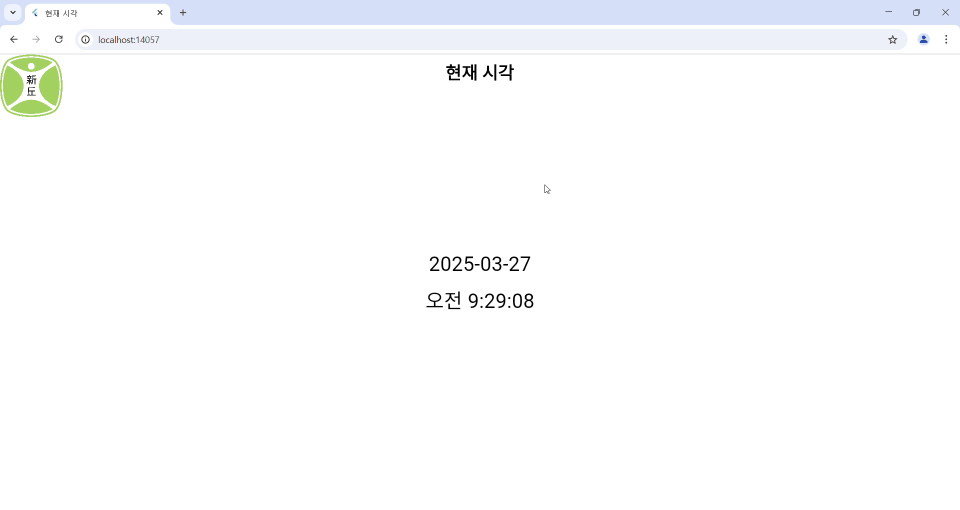

# 250325

## 현재 시각을 표시하는 앱
- 상단 앱바 타이틀 : "현재 시각"
- 정 중앙에 현재 시각을 표시

    ※ 초까지 표시할 것
- 현재 시각은 1초 마다 갱신

### 

#### 코드
```dart
import 'package:flutter/material.dart';
import 'dart:async';
import 'package:intl/intl.dart';
import 'package:intl/date_symbol_data_local.dart';

void main() async {
  WidgetsFlutterBinding.ensureInitialized();
  await initializeDateFormatting('ko_KR', null);
  runApp(const CurrentTimeApp());
}

class CurrentTimeApp extends StatelessWidget {
  const CurrentTimeApp({super.key});

  @override
  Widget build(BuildContext context) {
    return MaterialApp(
      title: '현재 시각',
      home: const TimeDisplayPage(),
      debugShowCheckedModeBanner: false,
    );
  }
}

class TimeDisplayPage extends StatefulWidget {
  const TimeDisplayPage({super.key});

  @override
  State<TimeDisplayPage> createState() => _TimeDisplayPageState();
}

class _TimeDisplayPageState extends State<TimeDisplayPage> {
  late Timer _timer;
  late DateTime _now;

  @override
  void initState() {
    super.initState();
    _now = DateTime.now();
    _timer = Timer.periodic(const Duration(seconds: 1), (timer) {
      setState(() {
        _now = DateTime.now();
      });
    });
  }

  @override
  void dispose() {
    _timer.cancel();
    super.dispose();
  }

  @override
  Widget build(BuildContext context) {
    final date = DateFormat('yyyy-MM-dd').format(_now);
    final time = DateFormat('a h:mm:ss', 'ko_KR').format(_now);

    return Scaffold(
      extendBodyBehindAppBar: true, // 🔸 앱바 내용 확장
      appBar: AppBar(
        backgroundColor: Colors.transparent, // 🔸배경 투명
        elevation: 0, // 🔸 그림자 제거
        title: const Text('현재 시각'),
        centerTitle: true,
        titleTextStyle: const TextStyle(
          fontSize: 28,
          fontWeight: FontWeight.bold,
          color: Colors.black,
        ),
      ),
      body: Stack(
        children: [
          // 🔹 좌상단 이미지
          Positioned(
            top: 0,
            left: 0,
            child: Image.asset(
              'assets/symbol_logo_01.jpg',
              width: 100,
              height: 100,
              fit: BoxFit.contain,
            ),
          ),

          // 🔹 중앙 날짜/시간
          Center(
            child: Column(
              mainAxisAlignment: MainAxisAlignment.center,
              children: [
                Text(date,
                    style: const TextStyle(fontSize: 32, color: Colors.black)),
                const SizedBox(height: 10),
                Text(time,
                    style: const TextStyle(fontSize: 32, color: Colors.black)),
              ],
            ),
          ),
        ],
      ),
      backgroundColor: const Color(0xFFFFFFFF), // 배경색 유지
    );
  }
}

```
