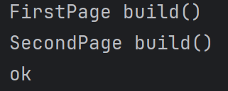
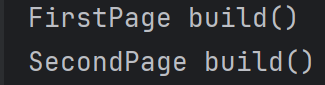
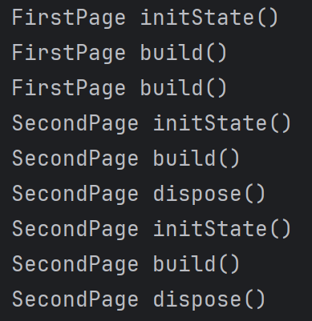

# 250408

## 입력용 위젯

| 위젯 | 설명 |
|------|------|
| **TextField** | 텍스트 입력 필드. `InputDecoration`으로 스타일 지정 가능 |
| **CheckBox / Switch** | 체크박스 및 토글 스위치 |
| **Radio / RadioListTile** | 여러 항목 중 하나 선택 |
| **DropDownButton** | 드롭다운 목록에서 선택 |

---

## 다이얼로그

| 위젯 | 설명 |
|------|------|
| **AlertDialog** | 사용자 확인 / 메시지 |
| **DatePicker** | 날짜 선택 |
| **TimePicker** | 시간 선택 |

>  `DatePicker`, `TimePicker`는 `Future<T>`를 사용함

---

## 이벤트 처리

| 위젯 | 설명 |
|------|------|
| **GestureDetector** | 클릭 등의 제스처 인식 (시각적 효과 없음) |
| **InkWell** | 클릭 시 물결 효과 제공 (머티리얼 디자인) |

---

## 애니메이션

| 위젯 | 설명 |
|------|------|
| **Hero** | 화면 전환 시 애니메이션, `tag` 일치 필수 |
| **AnimatedContainer** | 상태 변경에 따른 애니메이션 |
| **SliverAppBar + SliverFillRemaining** | 헤더가 동적으로 변경되는 UI |
| **SliverAppBar + SliverList** | `ListView`에 Sliver 효과 적용 |

---

## 쿠퍼티노 디자인 (iOS 스타일)

| 항목 | 머티리얼 | 쿠퍼티노 |
|------|----------|-----------|
| AppBar | AppBar | CupertinoNavigationBar |
| Switch | Switch | CupertinoSwitch |
| Button | ElevatedButton | CupertinoButton |
| Dialog | AlertDialog | CupertinoAlertDialog |
| Picker | X | CupertinoPicker |

---

## 내비게이션

### 화면 이동 기본

1. 새로운 화면으로 이동: `Navigator.push(context, MaterialPageRoute(...))`
2. 뒤로 가기: `Navigator.pop(context)`
3. 데이터 전달: 생성자 매개변수
4. 데이터 받기: `pop(value)` → `await push(...)`로 결과 받기

### Named Route 사용

- `routes` 정의 후:
  ```dart
  Navigator.pushNamed(context, '/second');
  ```

---

## 내비게이션 동작 이해

- **initState**: 위젯이 생성될 때
- **build**: UI를 다시 그릴 때
- **dispose**: 위젯이 종료될 때 (`pop` 시)

---

## 참고 링크

- [Flutter Material 위젯](https://docs.flutter.dev/ui/widgets/material)
- [Flutter Cupertino 위젯](https://docs.flutter.dev/ui/widgets/cupertino)
- [Flutter 샘플](https://github.com/flutter/samples)
- [Flutter 갤러리 앱](https://wonderous.app/web/)


## 과제
### 6.3.1
```dart
import 'package:flutter/material.dart';

void main() => runApp(MyApp());

class MyApp extends StatelessWidget {
  @override
  Widget build(BuildContext context) {
    return MaterialApp(
      title: 'Flutter Demo',
      theme: ThemeData(
        primarySwatch: Colors.blue,
        useMaterial3: false,
      ),
      home: FirstPage(),   // 첫 페이지를 시작 페이지로 지정
    );
  }
}

// 첫 페이지
class FirstPage extends StatelessWidget {
  @override
  Widget build(BuildContext context) {
    print('FirstPage build()');
    return Scaffold(
      appBar: AppBar(
        title: Text('First'),
      ),
      body: ElevatedButton(
        child: Text('다음 페이지로'),
        onPressed: () async {
          final result = await Navigator.push(
            context,
            MaterialPageRoute(builder: (context) => SecondPage()),
          );

          print(result);
        },
      ),
    );
  }
}


// 두번째 페이지
class SecondPage extends StatelessWidget {
  @override
  Widget build(BuildContext context) {
    print('SecondPage build()');
    return Scaffold(
      appBar: AppBar(
        title: Text('Second'),
      ),
      body: ElevatedButton(
        child: Text('이전 페이지로'),
        onPressed: () {
          Navigator.pop(context, 'ok');
        },
      ),
    );
  }
}
```


### 6.3.2
```dart
import 'package:flutter/material.dart';

void main() {
  runApp(const MaterialApp(home: FirstStatefulPage()));
}

// 첫 번째 페이지
class FirstStatefulPage extends StatefulWidget {
  const FirstStatefulPage({Key? key}) : super(key: key);

  @override
  State<FirstStatefulPage> createState() => _FirstStatefulPageState();
}

class _FirstStatefulPageState extends State<FirstStatefulPage> {
  @override
  Widget build(BuildContext context) {
    print("FirstPage build()");
    return Scaffold(
      appBar: AppBar(
        title: const Text("First"),
      ),
      body: ElevatedButton(
        child: const Text("다음 페이지로"),
        onPressed: () {
          final person = Person("홍길동", 20);
          Navigator.push(
            context,
            MaterialPageRoute(
              builder: (context) => SecondStatefulPage(person: person),
            ),
          );
        },
      ),
    );
  }
}

// 데이터 클래스
class Person {
  final String name;
  final int age;

  Person(this.name, this.age);
}

// 두 번째 페이지
class SecondStatefulPage extends StatefulWidget {
  final Person person;

  const SecondStatefulPage({Key? key, required this.person}) : super(key: key);

  @override
  State<SecondStatefulPage> createState() => _SecondStatefulPageState();
}

class _SecondStatefulPageState extends State<SecondStatefulPage> {
  @override
  Widget build(BuildContext context) {
    print("SecondPage build()");
    return Scaffold(
      appBar: AppBar(
        title: Text(widget.person.name),
      ),
      body: ElevatedButton(
        child: const Text("이전 페이지로"),
        onPressed: () {
          Navigator.pop(context);
        },
      ),
    );
  }
}
```

### 6.3.3
```dart
import 'package:flutter/material.dart';

void main() {
  runApp(const MaterialApp(home: FirstStatefulPage()));
}

// 데이터 클래스
class Person {
  final String name;
  final int age;

  Person(this.name, this.age);
}

// 첫 번째 페이지
class FirstStatefulPage extends StatefulWidget {
  const FirstStatefulPage({Key? key}) : super(key: key);

  @override
  State<FirstStatefulPage> createState() => _FirstStatefulPageState();
}

class _FirstStatefulPageState extends State<FirstStatefulPage> {
  @override
  void initState() {
    super.initState();
    print("FirstPage initState()");
  }

  @override
  void dispose() {
    super.dispose();
    print("FirstPage dispose()");
  }

  @override
  Widget build(BuildContext context) {
    print("FirstPage build()");
    return Scaffold(
      appBar: AppBar(
        title: const Text("First"),
      ),
      body: ElevatedButton(
        child: const Text("다음 페이지로"),
        onPressed: () {
          final person = Person("홍길동", 20);
          Navigator.push(
            context,
            MaterialPageRoute(
              builder: (context) => SecondStatefulPage(person: person),
            ),
          );
        },
      ),
    );
  }
}

// 두 번째 페이지
class SecondStatefulPage extends StatefulWidget {
  final Person person;

  const SecondStatefulPage({Key? key, required this.person}) : super(key: key);

  @override
  State<SecondStatefulPage> createState() => _SecondStatefulPageState();
}

class _SecondStatefulPageState extends State<SecondStatefulPage> {
  @override
  void initState() {
    super.initState();
    print("SecondPage initState()");
  }

  @override
  void dispose() {
    super.dispose();
    print("SecondPage dispose()");
  }

  @override
  Widget build(BuildContext context) {
    print("SecondPage build()");
    return Scaffold(
      appBar: AppBar(
        title: Text(widget.person.name),
      ),
      body: ElevatedButton(
        child: const Text("이전 페이지로"),
        onPressed: () {
          Navigator.pop(context);
        },
      ),
    );
  }
}
```

---